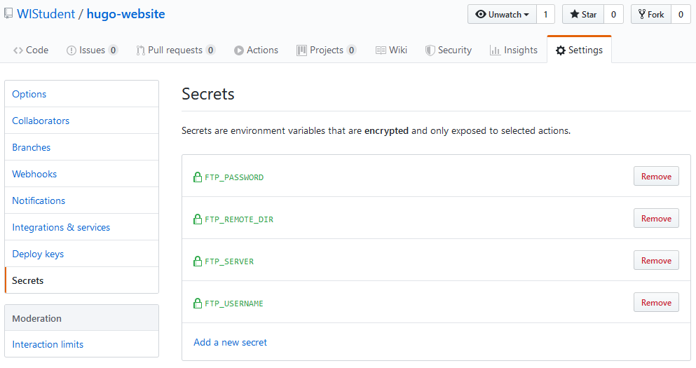

I recently got access to the [Github Actions](https://github.com/features/actions) beta, Github's new tool for CI/CD. Because I already host the [source files](https://github.com/WIStudent/hugo-website) of this website on Github, the next logical step would be to create an action workflow that builds it and deploys it to the server everytime I make a new commit on the master branch. The workflow looks like this:

```yaml
name: build and deploy

on:
  push:
    branches:
    - master

jobs:
  build_deploy:
    name: build and deploy
    runs-on: ubuntu-latest
    
    steps:
    - uses: actions/checkout@master
      with:
        submodules: true
    - name: build
      uses: peaceiris/actions-hugo@v0.57.2
    - name: deploy
      uses: SamKirkland/FTP-Deploy-Action@1.0.0
      env:
        FTP_SERVER: ${{ secrets.FTP_SERVER }}
        FTP_USERNAME: ${{ secrets.FTP_USERNAME }}
        FTP_PASSWORD: ${{ secrets.FTP_PASSWORD }}
        REMOTE_DIR: ${{ secrets.FTP_REMOTE_DIR }}
        LOCAL_DIR: ./public
      if: success()
```
It consists of three steps to checkout the source files, build the site and deploy it on the server. Luckily some other other people already created actions to build a hugo site and to copy files via ftp. The ftp step uses Github Secrets to not reveal my credentials to the public. Secrets can be added in the repository settings.

{{}}