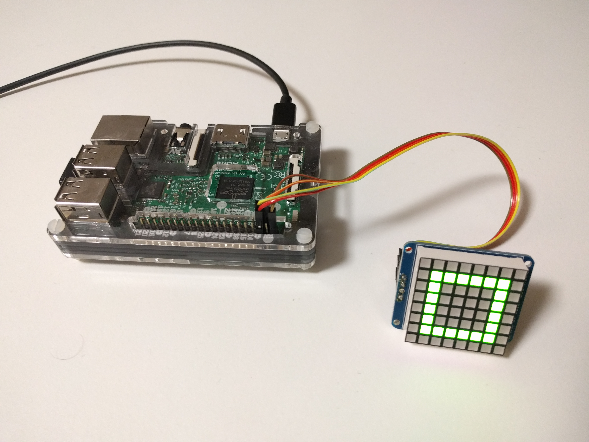
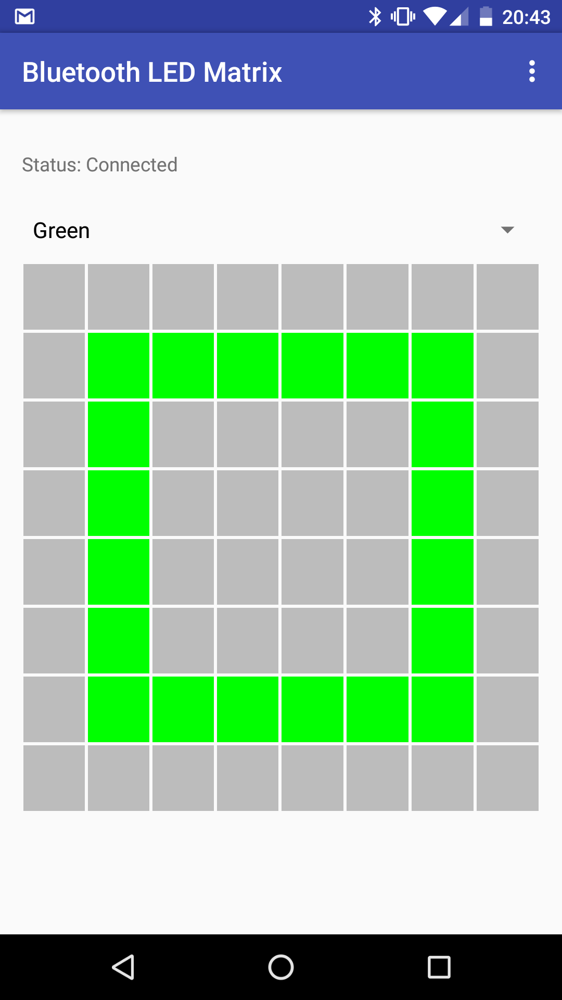

+++ 
draft = false
date = 2016-10-04T20:27:00+02:00
title = "Turning a Raspberry Pi 3 into a Bluetooth Low Energy peripheral"
description = ""
slug = "" 
tags = ["ble","raspberry pi"]
categories = []
externalLink = ""
series = []
+++
The 3rd version of the Raspberry Pi is able to communicate with other devices over classic Bluetooth and Bluetooth Low Energy (BLE). Combined with its GPIO pins this makes an attractive device to control whatever is connected to it with a smartphone over BLE. I will point out some helpful sources and tipps I found while I was trying to use a Raspberry Pi 3 to control an LED matrix over BLE.

First you need to learn some things about BLE. You will not get far without knowing what advertising, services and characteristics are. I read the book "Getting Started with Bluetooth Low Energy: Tools and Techniques for Low-Power Networking" to learn about these things. It teaches you everything you need to know to start developing BLE devices on less than 80 pages. If you do not want to read a book, there is also a short [introduction to BLE on Adafruit](https://learn.adafruit.com/introduction-to-bluetooth-low-energy/introduction).

Like many other Linux distributions Raspian uses BlueZ as its Bluetooth stack. Because some BLE features were just added recently to BlueZ, you should update it. There is a  [step-by-step tutorial on Adafruit](https://learn.adafruit.com/install-bluez-on-the-raspberry-pi/installation), just make sure that you download the latest version.

After successfully updating BlueZ you should take a look at the documentation for the [advertising](https://git.kernel.org/pub/scm/bluetooth/bluez.git/tree/doc/advertising-api.txt) and [GATT](https://git.kernel.org/pub/scm/bluetooth/bluez.git/tree/doc/gatt-api.txt) API. The python scripts [example-advertisement](https://git.kernel.org/pub/scm/bluetooth/bluez.git/tree/test/example-advertisement) and [example-gatt-server](https://git.kernel.org/pub/scm/bluetooth/bluez.git/tree/test/example-gatt-server) show how these APIs can be used to create and advertise a fake BLE heartrate monitor.

The easiest way to create your own BLE peripheral is to take the classes for services, characteristics, desriptors, advertisements, etc. from the examples and use them for your own project. Using this approach I created a [peripheral that allows me to control an LED matrix over BLE](https://github.com/WIStudent/Bluetooth-Low-Energy-LED-Matrix).

{{}}

[The Android app](https://github.com/WIStudent/Bluetooth-LED-Matrix-App) to control the matrix is shown below. Using Android's native BLE API can be annoying because it requires you to implement a lot of callback functions. Instead of using the native API directly, the app uses the [RxAndroidBle library](https://github.com/Polidea/RxAndroidBle), which makes communicating with BLE devices much easier.

{{}}
